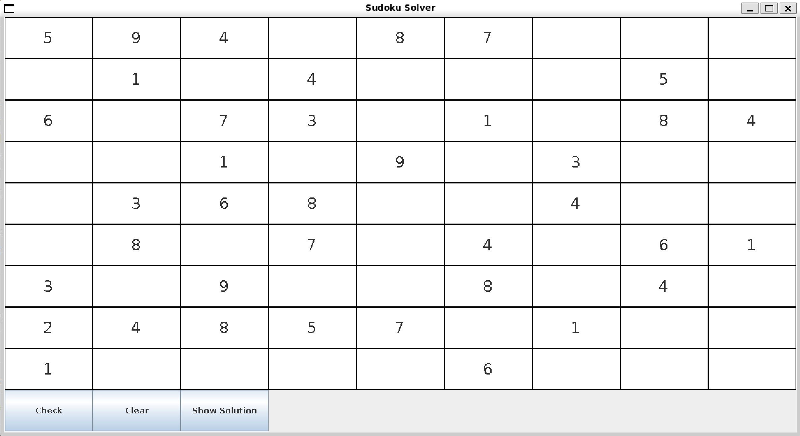
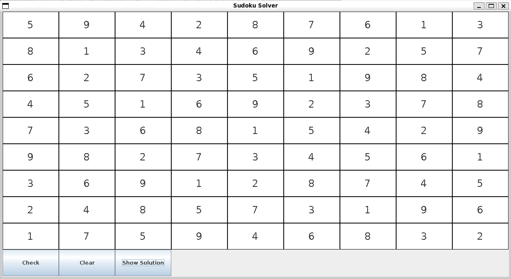

## This program allows users to input numbers and check solved sudokus!

### Example

#### It can also solve them!
Given a board with empty cells the program can solve a sudoku board using recursive backtracking. I wrote it all by my myself, mainly to see what Java is all about.

#### The board above after being solved by my program 😊

